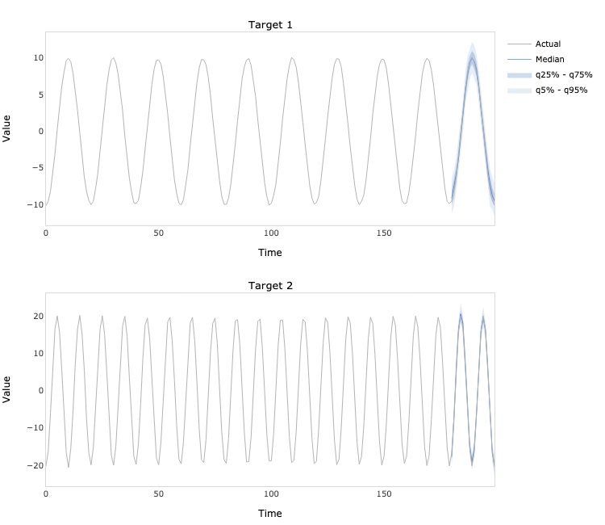
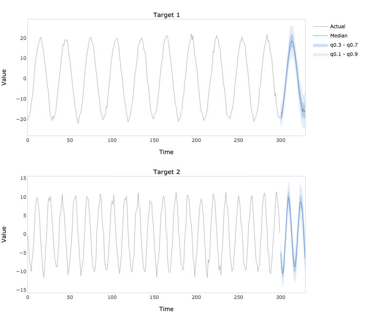

## ProbCast TensorFlow
TensorFlow (Python) implementation of multivariate time series forecasting model introduced in Koochali, A., Dengel, A.,
& Ahmed, S. (2021). If You Like It, GAN It — Probabilistic Multivariate Times Series Forecast with GAN.
In Engineering Proceedings (Vol. 5, No. 1, p. 40). Multidisciplinary Digital Publishing Institute.
[https://doi.org/10.3390/engproc2021005040](https://doi.org/10.3390/engproc2021005040).

### Dependencies
```bash
pandas==1.3.4
numpy==1.19.5
tensorflow==2.7.0
plotly==5.3.1
kaleido==0.2.1
```
### Usage
```python
import numpy as np
from probcast_tensorflow.model import ProbCast

# Generate two time series
N = 300
t = np.linspace(0, 1, N)
e = np.random.multivariate_normal(mean=[0, 0], cov=[[1, 0.25], [0.25, 1]], size=N)
a = 20 * np.cos(2 * np.pi * (10 * t - 0.5)) + e[:, 0]
b = 10 * np.sin(2 * np.pi * (20 * t - 0.5)) + e[:, 1]
y = np.hstack([a.reshape(- 1, 1), b.reshape(- 1, 1)])

# Fit the model
model = ProbCast(
    y=y,
    forecast_length=30,
    sequence_length=60,
    quantiles=[0.1, 0.3, 0.5, 0.7, 0.9],
    generator_gru_units=[64, 32],
    discriminator_gru_units=[64, 32],
    generator_dense_units=16,
    discriminator_dense_units=16,
    noise_dimension=100,
    noise_dispersion=10,
)

model.fit(
    learning_rate=0.001,
    batch_size=32,
    epochs=100,
    verbose=True
)
```
```python
# Plot the in-sample predictions
predictions = model.predict(index=270)
fig = model.plot_predictions()
fig.write_image('predictions.png', width=750, height=650)
```

```python
# Plot the out of sample forecasts
forecasts = model.forecast()
fig = model.plot_forecasts()
fig.write_image('forecasts.png', width=750, height=650)
```

