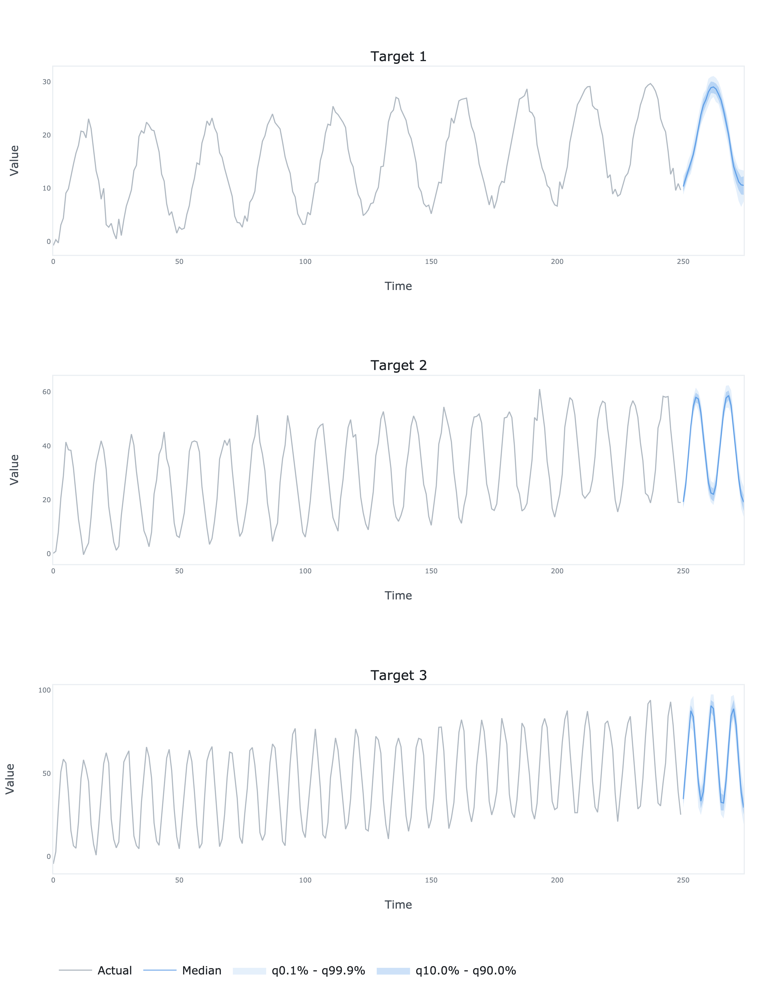

# ProbCast TensorFlow


TensorFlow implementation of multivariate time series forecasting model introduced in Koochali, A., Dengel, A.,
and Ahmed, S. (2021). If You Like It, GAN It — Probabilistic Multivariate Times Series Forecast with GAN.
In *Engineering Proceedings* (Vol. 5, No. 1, p. 40). Multidisciplinary Digital Publishing Institute.


*Model architecture (source: [doi: 10.3390/engproc2021005040](https://doi.org/10.3390/engproc2021005040))*

## Dependencies
```bash
pandas==1.5.2
numpy==1.23.5
tensorflow==2.11.0
plotly==5.11.0
kaleido==0.2.1
```
## Usage
```python
import numpy as np

from probcast_tensorflow.model import ProbCast
from probcast_tensorflow.plots import plot

# Generate some time series
N = 250
t = np.linspace(0, 1, N)
e = np.random.multivariate_normal(mean=np.zeros(3), cov=np.eye(3), size=N)
a = 10 + 10 * t + 10 * np.cos(2 * np.pi * (10 * t - 0.5)) + 1 * e[:, 0]
b = 20 + 20 * t + 20 * np.cos(2 * np.pi * (20 * t - 0.5)) + 2 * e[:, 1]
c = 30 + 30 * t + 30 * np.cos(2 * np.pi * (30 * t - 0.5)) + 3 * e[:, 2]
y = np.hstack([a.reshape(-1, 1), b.reshape(-1, 1), c.reshape(-1, 1)])

# Fit the model
model = ProbCast(
    y=y,
    forecast_length=25,
    sequence_length=50,
    quantiles=[0.001, 0.1, 0.5, 0.9, 0.999],
    generator_gru_units=[64],
    discriminator_gru_units=[32],
    generator_dense_units=16,
    discriminator_dense_units=8,
    noise_dimension=100,
    noise_dispersion=10,
)

model.fit(
    learning_rate=0.001,
    batch_size=16,
    epochs=200,
    verbose=True
)

# Generate the forecasts
df = model.forecast(y=y)

# Plot the forecasts
fig = plot(df=df, quantiles=[0.001, 0.1, 0.5, 0.9, 0.999])
fig.write_image('results.png', scale=4, height=900, width=700)
```

